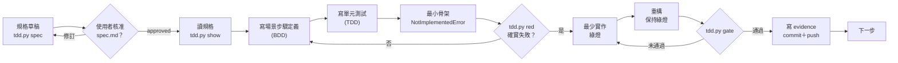

# Tour Reel Studio — 開發計畫（Spec-Driven Development；BDD＋TDD 驗證）

> 文件版本：v1.2（2026-09-29）— 閘門加入規格檢查、evidence 與自動 commit／push
> 依據：`spec-driven-development.md`、`system-architecture.md` v1.0、`tourism-ai-video-concept.md` v0.3 §8.1
> 本文件定義 MVP 的工作順序；每項功能的可實作規格、核准與變更流程以 `spec-driven-development.md` 為準。Claude Code 不得自行修改已核准規格。

---

## 1. 開發方法

### 1.0 以規格驅動開發（SDD）

本計畫不再將 BDD 場景與 TDD 測試視為最上游的需求來源；它們是**已核准規格的可執行驗證**。每個 S01–S19 步驟開始前，先依 `spec-driven-development.md` 建立並核准對應的 spec package；未核准的規格不得產生產品程式碼。

文件優先順序為：**已核准 spec package > 同 package 的 BDD 場景與 API／資料契約 > 本開發計畫 > 系統架構書 > 構想文件**。文件互相矛盾、需求未標示驗收條件，或 Claude Code 無法判定需求時，必須停止並請使用者決定。

### 1.1 為什麼混合 BDD 與 TDD

| | BDD（由外而內） | TDD（由內而外） |
|---|---|---|
| 回答的問題 | 「系統的行為對不對？」 | 「這段程式碼的邏輯對不對？」 |
| 寫在哪裡 | `features/*.feature`（Gherkin，使用者撰寫、受保護） | `backend/tests/unit/`、`apps/web/src/**/*.test.ts`（Claude Code 撰寫） |
| 粒度 | 一個場景＝一個可觀察的行為 | 一個測試＝一個函式或規則的邊界 |
| 誰決定內容 | 使用者（規格） | Claude Code（依本文件的清單，可再增加） |

BDD 場景定義「做完」的樣子，並且不能被開發者改動；TDD 單元測試逼出好的內部設計並覆蓋邊界情況。兩者都通過，步驟才算完成。

### 1.2 每個步驟的循環



### 1.3 閘門檢查什麼

`python3 scripts/tdd.py spec` 檢查規格草稿結構（不要求核准）：
1. 每個 `R-xxx` 至少有一個 `AC-xxx`；每個 AC 標明對應的 R
2. 「驗收對應」表中每個 AC 都對應到本步驟的場景，且本步驟每個非 external 場景都被至少一個 AC 對應
3. `design.md`、`tasks.md` 已建立

`python3 scripts/tdd.py red` 要求：
0. 上述規格檢查通過，且 `spec.md` 狀態為 `approved`、「核准者／時間」已由使用者填寫
1. 本步驟**每個**非 external 場景都已有對應的測試
2. 單元測試數量達到本步驟的最低要求
3. 測試能被收集並執行（收集／匯入錯誤不算紅燈）
4. 至少一個測試失敗

紅燈記錄後，自動在本機 commit `test(SNN): 紅燈 — <步驟名稱>`（不 push）。

`python3 scripts/tdd.py gate` 要求：
0. 規格仍為已核准狀態
1. 已記錄紅燈
2. lint 通過（ruff；前端另加 eslint 與 `tsc --noEmit`）
3. **S01 到目前步驟**的所有測試全數通過（回歸），沒有任何略過或 xfail
4. 每個後端測試都有步驟標記
5. S01 到目前步驟的每個場景都有**通過**的測試
6. 本步驟的單元測試數量達標
7. 本步驟要求的報告已填寫完整

通過後依序自動執行：
1. 在 `specs/<package>/evidence.md` 寫入閘門紀錄（紅燈、回歸範圍、測試數、AC 與場景結果）
2. 將 `spec.md` 狀態改為 `implemented`（使用者完成人工驗收後自行改為 `validated`）
3. `.tdd/progress.json` 記錄完成時間與測試數，目前步驟前進一步
4. 掃描機密（`.env`、金鑰檔、疑似 API 金鑰），通過後 commit `feat(SNN): <步驟名稱>` 並 push 到遠端；發現機密時取消 commit 並警告

commit 或 push 失敗不會讓閘門失敗，但會明確警告；commit 保留在本機，可稍後手動 push。以環境變數 `TRS_NO_PUSH=1` 可只 commit 不 push，`TRS_NO_GIT=1` 可完全停用。

### 1.4 防止繞過

| 手段 | 說明 |
|---|---|
| PreToolUse hook | `.claude/hooks/protect_specs.py` 阻擋 Claude Code 修改 `features/`、閘門腳本、進度檔、本文件、SDD 規範、已核准規格與 evidence，並記錄於 `.tdd/hook.log` |
| 核准欄位保護 | Claude Code 不能寫入或更改「狀態」「核准者／時間」「審核人」「驗收者」 |
| 規格閘門 | 規格未核准不能記錄紅燈；AC 與場景必須雙向對應 |
| 不接受略過 | 閘門遇到 skip 或 xfail 一律不通過 |
| 場景覆蓋比對 | 以場景編號比對測試名稱，確保每個場景都有測試且通過 |
| 紅燈紀錄 | 沒有紅燈紀錄不能執行閘門，確保測試先於實作 |
| 人工報告 | S00、S19 的報告需要使用者填寫「審核人」 |

使用者要修改規格時，須依 `spec-driven-development.md` 建立變更請求、完成影響分析並核准新版 spec；暫時解除保護的檔案僅限該次變更，完成後立即重新鎖定。操作方式：核准 `changes/CR-xxxx.md` 後，在終端機執行 `python3 scripts/tdd.py unlock CR-xxxx <檔案…> --minutes 30`，完成後執行 `python3 scripts/tdd.py lock`（詳見 `changes/README.md`）。

---

## 2. 步驟總覽

| 步驟 | 名稱 | 里程碑 | 測試 | 場景 | 單元測試下限 | 依賴 |
|---|---|---|---|---|---|---|
| S00 | 技術驗證 | M0 | 報告 | — | — | — |
| S01 | 開發骨架與測試閘門 | M1 | py | 3 | 2 | S00 |
| S02 | 影片狀態機 | M1 | py | 4 | 3 | S01 |
| S03 | 核准與失效 | M1 | py | 5 | 3 | S02 |
| S04 | 成本估算與預算控制 | M1 | py | 6 | 3 | S01 |
| S05 | 資料持久化 | M1 | py | 5 | 2 | S02–S04 |
| S06 | 生成工作與重試 | M1 | py | 6 | 3 | S03–S05 |
| S07 | 快速模式工作編排 | M1 | py | 6 | 2 | S06 |
| S08 | REST API 與 SSE | M1 | py | 7 | 2 | S07 |
| S09 | 物件儲存 | M2 | py | 4 | 1 | S01 |
| S10 | 企劃產生 PromptEngine | M2 | py | 6 | 3 | S07 |
| S11 | B1 照片合成 | M2 | py | 6 | 3 | S09 |
| S12 | Higgsfield adapter | M2 | py | 7（＋1 external） | 3 | S06、S09、S11 |
| S13 | 時間軸與影片合成 | M3 | py | 6 | 2 | S09 |
| S14 | 片尾卡 | M3 | py | 4 | 2 | S13 |
| S15 | 前端：選題與企劃確認 | M3 | web＋e2e | 6 | 2 | S08 |
| S16 | 前端：進度與成品確認 | M3 | web＋e2e | 6 | 2 | S15 |
| S17 | Demo 種子資料 | M4 | py | 4 | 1 | S05、S09 |
| S18 | Demo 可靠性 | M4 | py | 5 | 2 | S12 |
| S19 | 端對端驗收 | M4 | e2e＋報告 | 3（＋1 external） | 0 | 全部 |

里程碑對應架構書 §13：M0 技術驗證、M1 骨架（全部使用假實作跑通流程）、M2 生成串接、M3 合成與介面、M4 Demo 強化。

**M1 結束時的狀態**：不需要任何外部 API，就能以 FakeProvider 從主題跑到成品的完整狀態流程。之後的步驟都是把假實作換成真實作，而回歸測試保證流程不會被破壞。

---

## 3. 步驟說明

### S00 技術驗證（M0）

**目標**：在寫任何產品程式碼前，確認最不確定的技術假設，並選定模型與單價。
**架構書**：§13 M0；構想文件 §9 #1–#4
**產出**：`docx/validation/S00-report.md`（閘門檢查欄位是否填寫完整）

**驗證項目**
1. 以 tourism-promo 結構（鉤子 4 秒、特色 5 秒、行動呼籲 3 秒）手動產生一支宣傳片的企劃與提示詞
2. 以 3–5 張真實景點照，手動完成 B1 粗合成 → Higgsfield 精修 → 圖生影片
3. 比較 1–2 個模型組合的品質、點數、耗時，選定 `HF_IMAGE_MODEL`、`HF_VIDEO_MODEL`
4. 同一角色生成 3 個鏡頭，觀察一致性

**做法**：可以在 `spikes/` 目錄寫一次性腳本（不受閘門管理，完成後保留作為紀錄）。

**完成定義**：報告無 TODO，使用者填寫「審核人」。

---

### S01 開發骨架與測試閘門

**目標**：建立後端專案、測試基礎建設與設定載入，讓之後每一步都能累積測試。
**架構書**：§4、§9.2、§12
**場景**：`features/api/s01_skeleton.feature`（S01-01～03）

**要建立**
- `git init`、`.gitignore`
- `backend/pyproject.toml`（Poetry）：fastapi、pydantic-settings、pytest、pytest-bdd、pytest-asyncio、httpx、ruff、mypy
- pytest 設定：
  ```toml
  [tool.pytest.ini_options]
  bdd_features_base_dir = "../features"
  markers = ["S00", "S01", …, "S19", "integration", "external"]   # 全部列出
  addopts = "--strict-markers"
  ```
- 目錄：`backend/app/{api,domain,creative,providers,render,jobs,storage,seed}`、`backend/tests/{unit,bdd}`
- `app/config.py`：以 pydantic-settings 載入設定；`APP_ENV=production` 時必要金鑰缺少即報錯
- `app/api/main.py`：FastAPI app 與 `GET /health`
- `.env.example`

**單元測試（至少 2）**
- 測試模式不需要任何 API 金鑰也能載入設定
- 正式模式缺少多個金鑰時，錯誤訊息列出全部缺少的名稱
- 模型名稱、成本單價表路徑可由環境變數覆寫

**完成定義**：閘門通過；`ruff check` 無錯誤。

---

### S02 影片狀態機

**目標**：實作架構書 §6.1 的影片狀態機，作為所有流程的核心規則。
**架構書**：§6.1
**場景**：`features/api/s02_video_state.feature`（S02-01～04）

**設計要點**
- `app/domain/video.py`：`VideoStatus`、`VideoEvent` 列舉；轉換表以資料（dict）表示，不用一長串 if
- `Video.apply(event)` 回傳新狀態並寫入歷程；不合法時拋出 `InvalidTransition`
- 純領域邏輯，不依賴資料庫或框架

**單元測試（至少 3）**
- 轉換表涵蓋所有狀態（每個非終止狀態至少一個出口）
- 對所有「狀態 × 事件」組合窮舉：不在表中的組合都拋出錯誤
- `approved` 與 `failed` 是終止狀態
- 歷程紀錄包含事件名稱與時間

---

### S03 核准與失效

**目標**：核准綁定輸入雜湊，內容改變即失效；快速模式自動核准要可辨識。
**架構書**：§6.3
**場景**：`features/api/s03_approval.feature`（S03-01～05）

**設計要點**
- `app/domain/approval.py`：`Approval`（kind、input_hash、cost_cap、auto_approved、approved_at）
- `canonical_hash(obj)`：以排序鍵、固定分隔符序列化後 SHA-256
- `ensure_still_approved(approval, current_input)`：不一致時拋出 `ApprovalInvalidated`，並觸發影片回到 `plan_ready`

**單元測試（至少 3）**
- 雜湊不受字典鍵順序影響，但受串列順序影響（鏡頭順序是有意義的）
- 浮點數擺放參數的表示方式固定（例如四捨五入到 4 位小數），避免無意義的差異
- `cost_cap` 必須為正數
- 核准種類只允許 `plan`、`final`、`script`、`assets`、`keyframes`

---

### S04 成本估算與預算控制

**目標**：生成前可估算，送出前必檢查，完成後正確記帳。
**架構書**：§6.4
**場景**：`features/api/s04_cost.feature`（S04-01～06）

**設計要點**
- `app/domain/cost.py`：`CostTable`（由設定檔載入）、`estimate(plan)`、`cap_for(estimate)`、`Budget.check(next_cost)`
- 成本上限＝預估成本＋一鏡完整重生（關鍵幀＋影片）
- 點數以整數表示，不使用浮點數

**單元測試（至少 3）**
- 鏡頭數為 0 時預估為 0
- 剛好等於上限時允許送出，超過 1 點即拒絕
- 實際成本與預估不同時，以實際成本計入已花費
- 單價表檔案格式錯誤時給出清楚的錯誤

---

### S05 資料持久化

**目標**：以 SQLAlchemy＋Alembic 實作架構書 §7 的資料模型與 repository。
**架構書**：§7
**場景**：`features/api/s05_persistence.feature`（S05-01～05，`@integration`）

**要建立**
- `infra/docker-compose.test.yml`：PostgreSQL、Redis、MinIO（閘門會自動 `up -d --wait`）
- `app/storage/db.py`、`app/storage/models.py`、`alembic/`
- repository 介面放在 `app/domain/ports.py`，另提供記憶體版實作供單元測試使用

**單元測試（至少 2）**
- 記憶體版 repository 與資料庫版行為一致（以同一組測試參數化執行兩種實作）
- JSON 欄位（placement、timeline）寫入與讀回型別一致
- 冪等鍵格式 `video:shot:kind:hash:attempt` 的組成函式

---

### S06 生成工作與重試

**目標**：生成工作的狀態流程、自動重試一次、逾時、冪等、送出前檢查核准與預算。
**架構書**：§5.5、§6.2
**場景**：`features/api/s06_generation_job.feature`（S06-01～06）

**設計要點**
- `app/providers/base.py`：`ImageProvider`、`VideoProvider`、`ProviderJob`、`ProviderResult`
- `app/providers/fake.py`：`FakeProvider`，可設定成功、第 N 次失敗、永遠失敗、永不完成、耗時
- `app/jobs/generation.py`：`run_generation_job(...)` 依序執行 核准檢查 → 預算檢查 → 送出 → 等待 → 轉存 → 記帳
- 逾時與輪詢間隔由設定決定，測試中使用很短的值

**單元測試（至少 3）**
- 重試次數上限為 1（總共送出 2 次）
- 不可重試的錯誤（non_retryable）不重試，直接 `failed_final`
- 逾時計時從 `submitted` 開始
- 冪等鍵相同但輸入雜湊不同時，視為新工作

---

### S07 快速模式工作編排

**目標**：用假實作把「主題 → 企劃 → 3 鏡平行生成 → 合成 → 成品確認」整條流程串起來。
**架構書**：§5.2
**場景**：`features/api/s07_orchestration.feature`（S07-01～06）

**設計要點**
- `app/creative/base.py`：`CreativeEngine` 介面；`FakeCreativeEngine` 回傳固定企劃
- `app/render/base.py`：`Renderer` 介面；`FakeRenderer` 只產生時間軸 JSON 與空白檔案
- `app/jobs/orchestrator.py`：以 `asyncio.gather` 平行處理 3 鏡；每鏡內關鍵幀 → 影片依序
- `app/jobs/events.py`：進度事件發布介面；記憶體版供測試，Redis 版在 S08 使用
- 快速模式自動採用的階段寫入 `auto_approved=True` 的核准紀錄

**單元測試（至少 2）**
- 事件資料結構包含 `type`、`video_id`、`shot_no`（若有）、`at`
- 部分鏡頭失敗時，已完成鏡頭的結果被保留
- 重生單鏡時，其他鏡頭的 `current_take` 不變

---

### S08 REST API 與 SSE

**目標**：以 FastAPI 實作架構書 §8 的端點與 SSE 進度串流。
**架構書**：§8
**場景**：`features/api/s08_api.feature`（S08-01～07）

**設計要點**
- 路由只做驗證與呼叫領域服務；狀態錯誤統一轉成 409，驗證錯誤 422
- `Idempotency-Key`：以 Redis 或資料表保存「鍵 → 回應」，同鍵重送回傳相同回應
- SSE：`GET /videos/{id}/events`，事件來源為 S07 的事件發布介面（Redis pub/sub）
- 測試用 httpx `AsyncClient` 搭配 FastAPI app；Worker 在測試中同步執行或以假佇列替代

**單元測試（至少 2）**
- `InvalidTransition` → 409、`ApprovalInvalidated` → 409、`BudgetExceeded` → 409 的例外對應
- Idempotency-Key 相同但請求內容不同時回應 422
- SSE 事件格式（`event:`、`data:` JSON）

---

### S09 物件儲存

**目標**：S3 相容儲存封裝、路徑規則、預簽名網址。
**架構書**：§4、§7
**場景**：`features/api/s09_storage.feature`（S09-01～04，`@integration`）

**設計要點**
- `app/storage/objects.py`：`Storage` 介面（put、get、exists、presign_put、presign_get）；S3 實作用 boto3；記憶體實作供其他步驟使用
- `app/storage/keys.py`：路徑規則全部集中在這裡，其他地方不可自行拼接路徑

**單元測試（至少 1）**
- 每一種路徑（logo、身份板、去背圖、實景照、粗合成、關鍵幀、鏡頭影片、成品）的產生函式
- 路徑參數含 `/` 或 `..` 時拒絕

---

### S10 企劃產生 PromptEngine

**目標**：以 tourism-promo 模板呼叫 Claude，產生符合 JSON Schema 的企劃與每鏡提示詞。
**架構書**：§5.4
**場景**：`features/api/s10_prompt_engine.feature`（S10-01～06）

**設計要點**
- `backend/app/creative/skills/tourism-promo/SKILL.md`：題材規則（15 秒、3 鏡、鉤子→特色→行動呼籲、繁體中文）
- `app/creative/prompt_engine.py`：組提示詞 → 呼叫 Claude（結構化輸出）→ Pydantic 驗證 → 語意驗證（實景照存在、長度合計 12 秒、擺放範圍）→ 失敗重試一次
- Claude client 以介面注入；測試使用 `tests/fixtures/claude/*.json` 預錄回應
- 另寫一個 `@external` 測試（不列入閘門）供手動呼叫真實 API

**單元測試（至少 3）**
- Pydantic schema 拒絕缺少欄位、鏡頭數不為 3、role 順序錯誤
- 長度合計不為 12 秒時視為無效
- 提示詞中的實景照清單包含 id 與描述
- 模型名稱來自設定

---

### S11 B1 照片合成

**目標**：依擺放參數產生粗合成圖與遮罩，並組出精修合成請求。
**架構書**：§5.3
**場景**：`features/api/s11_b1_composite.feature`（S11-01～06）

**設計要點**
- `app/providers/composite.py`：以 Pillow 實作；擺放參數定義——`x`、`y`：角色腳底中心的比例位置；`scale`：角色高度 ÷ 照片高度
- 測試圖片用程式產生（純色實景照＋有透明區域的角色圖），不依賴外部檔案
- 精修請求（`ComposeRequest`）只組資料，不呼叫供應商

**單元測試（至少 3）**
- 縮放保持角色長寬比
- 角色完全在畫面外時拋出錯誤（部分超出則裁切）
- 遮罩與角色 alpha 通道一致
- 提示詞模板包含「保留背景」「統一光線與陰影」

---

### S12 Higgsfield adapter

**目標**：以 Higgsfield API 實作 `ImageProvider`、`VideoProvider`，並接收 webhook。
**架構書**：§5.5
**場景**：`features/api/s12_higgsfield.feature`（S12-01～07；S12-08 為 external）

**開始前**：閱讀 https://docs.higgsfield.ai/docs，確認實際的端點、欄位、狀態值與 webhook 驗證方式。若與場景描述的欄位名稱不同，以 adapter 內部轉換對應，不修改場景；若行為上無法滿足場景，停下來告知使用者。

**設計要點**
- `app/providers/higgsfield.py`：優先使用官方 Python SDK；無法 mock 時改用 httpx 直接呼叫
- 測試以 `respx` mock HTTP
- 錯誤分類：429、5xx → retryable；其他 4xx → non_retryable
- 結果網址取得後立即經 `Storage` 轉存
- 日誌過濾器遮蔽 API 金鑰

**單元測試（至少 3）**
- 狀態值對應（Higgsfield 狀態 → 內部 `running`／`succeeded`／`failed`）
- 成本欄位解析；缺少時回傳 None
- webhook 簽章驗證函式（正確、錯誤、缺少）
- 請求內容不包含音訊生成

---

### S13 時間軸與影片合成

**目標**：由鏡頭結果組出時間軸 JSON，以 FFmpeg 合成 15 秒、1080×1920 Reels。
**架構書**：§5.6；構想文件 §5.3
**場景**：`features/api/s13_render.feature`（S13-01～06）

**設計要點**
- `app/render/timeline.py`：時間軸 Pydantic 模型與組裝函式
- `app/render/ffmpeg.py`：由時間軸產生 FFmpeg 指令；以 ffprobe 驗證輸出
- 測試素材用 FFmpeg `testsrc`、`sine` 即時產生；字型檔 Noto Sans TC 放在 `backend/assets/fonts/`
- 需要本機安裝 FFmpeg（`brew install ffmpeg`）

**單元測試（至少 2）**
- 時間軸片段連續、不重疊
- FFmpeg 指令組裝（不執行，只檢查參數：尺寸、fps、編碼、字幕濾鏡）
- ASS 時間格式轉換（秒 → `H:MM:SS.cc`）

---

### S14 片尾卡

**目標**：由品牌檔案產生片尾卡圖片與 3 秒影片段。
**架構書**：§5.6
**場景**：`features/api/s14_outro.feature`（S14-01～04）

**設計要點**
- `app/render/outro.py`：Pillow 繪製；QR code 用 `qrcode` 套件
- QR 解碼驗證用 OpenCV `QRCodeDetector`（僅測試依賴）

**單元測試（至少 2）**
- 店名過長時自動縮小字級而不超出安全區
- 主色字串解析（`#RGB`、`#RRGGBB`；格式錯誤時報錯）
- 文字顏色依主色亮度自動選黑或白

---

### S15 前端：選題與企劃確認

**目標**：Next.js 前端的選題、企劃卡、角色擺放與核准。
**架構書**：§5.2 確認點 1、§5.3
**場景**：`features/web/s15_plan_confirm.feature`（S15-01～06）

**要建立**
- `apps/web`：Next.js＋TypeScript、eslint、vitest、@playwright/test、playwright-bdd、react-konva
- `playwright.config.ts`：
  ```ts
  const testDir = defineBddConfig({
    features: "../../features/web/**/*.feature",
    steps: "e2e/steps/**/*.ts",
  });
  ```
  並以 `webServer` 啟動 Next.js 開發伺服器
- API 型別：由後端 OpenAPI 產生（`openapi-typescript`），不要手寫
- 以 Playwright `page.route` mock API，SSE 以回應串流模擬

**單元測試（至少 2，`describe("[S15] …")`）**
- 擺放座標轉換：畫布像素 ↔ 比例值（0–1），含照片縮放顯示的情況
- 成本顯示格式（點數千分位）
- 核准請求內容組裝（含 Idempotency-Key 產生）

---

### S16 前端：進度與成品確認

**目標**：進度頁、失敗鏡頭重生、成品播放、下載與確認。
**架構書**：§5.2 確認點 2
**場景**：`features/web/s16_progress_review.feature`（S16-01～06）

**設計要點**
- SSE 用 `EventSource`；斷線時指數退避重連，重連後以 `GET /videos/{id}` 補回狀態
- 進度狀態以 reducer 管理（事件 → 畫面狀態），方便單元測試

**單元測試（至少 2，`describe("[S16] …")`）**
- 進度 reducer：事件亂序到達時結果仍正確
- 剩餘預算計算與「需要再次確認」判斷
- 重連退避時間序列

---

### S17 Demo 種子資料

**目標**：可重複執行的種子腳本，建立 Demo 專案。
**架構書**：§9.3
**場景**：`features/api/s17_seed.feature`（S17-01～04，`@integration`）

**設計要點**
- `seed/demo/`：品牌資料 JSON、Logo、角色身份板與去背圖、3–5 張實景照（使用者提供）
- `seed/cache/firecrawl-<domain>.json`：官網擷取快取；無網路時使用
- `app/seed/run.py`：以自然鍵（專案名稱、檔案雜湊）判斷是否已存在，確保冪等

**單元測試（至少 1）**
- 種子資料 JSON 的 schema 驗證
- Firecrawl 回應轉換為品牌檔案欄位

---

### S18 Demo 可靠性

**目標**：沒有 webhook 也能完成、重複通知只處理一次、Worker 重啟可接續、保底成品。
**架構書**：§9.3
**場景**：`features/api/s18_reliability.feature`（S18-01～05）

**設計要點**
- 結果處理以「工作狀態條件更新」確保只處理一次（`UPDATE … WHERE status = 'running'`）
- Worker 啟動時掃描 `submitted`／`running` 的工作並恢復輪詢
- 保底成品：設定 `DEMO_FALLBACK_VIDEO` 與展示門檻秒數；`GET /videos/{id}` 超過門檻時多回傳 `fallback_url`

**單元測試（至少 2）**
- 條件更新失敗時不重複轉存（以記憶體 repository 模擬並行）
- 恢復輪詢只處理未逾時的工作
- 保底門檻計算

---

### S19 端對端驗收

**目標**：前後端實際連線跑完整快速流程；以真實 Higgsfield 完成驗收報告。
**架構書**：§1.2、§9.4；構想文件 §8.1、§9 #5
**場景**：`features/web/s19_acceptance.feature`（S19-01～03；S19-04 為 external）
**報告**：`docx/validation/S19-report.md`

**設計要點**
- `infra/docker-compose.e2e.yml`：web、api、worker、postgres、redis、minio，`PROVIDER=fake`
- Playwright `globalSetup` 啟動 compose 並執行種子腳本
- 下載的 MP4 以 ffprobe 驗證尺寸與長度
- 真實驗收：使用者設定金鑰後執行 S19-04，並找 3 位非技術使用者計時，結果寫入報告

**完成定義**：閘門通過，且報告由使用者填寫「審核人」。

---

## 4. 第二階段以後

MVP 完成後，新的功能先建立新的 spec package，再由核准規格產出 BDD 場景、TDD 任務與開發步驟；不可直接新增 `features/` 繞過規格核准。建議順序依架構書 §11：進階模式 → drama-skills 引擎 → 商家洞察 → AR 取景 → 多比例與多語 → 編輯器。
