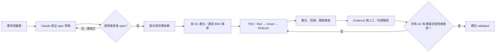

# Tour Reel Studio — Spec-Driven Development 規範

> 文件版本：v1.1（2026-09-29）— 對齊已建立的閘門、hook 與 spec 範本（§3、§4.4、§9–§11）
> 適用對象：使用者（產品與核准者）、Claude Code（實作者）
> 適用範圍：競賽 MVP 與後續第二、三階段功能

---

## 1. 目的

本專案採用 **Spec-Driven Development（SDD）**：先把可驗收的產品意圖寫成並核准為規格，再由規格衍生 BDD 場景、TDD 測試、實作與驗收證據。TDD 不是需求來源，而是確保實作持續符合規格的機制。

**唯一原則：沒有已核准的 spec package，就沒有產品程式碼。**

## 2. 文件優先順序與角色

### 2.1 衝突時的優先順序

1. 已核准的 spec package
2. 同一 package 的 API／資料契約與 BDD 場景
3. `development-plan.md`
4. `system-architecture.md`
5. `tourism-ai-video-concept.md`

若文件矛盾、規格缺少驗收條件，或需求可有多種合理解讀，Claude Code 必須停止實作、說明衝突與等待使用者決定；不得自行選擇產品行為。

### 2.2 權責

| 角色 | 可做 | 不可做 |
|---|---|---|
| 使用者 | 提出目標、核准 spec、核准規格變更、填寫真實 API／使用者驗收結果 | — |
| Claude Code | 讀取已核准規格、提出 spec 草稿、撰寫測試與實作、回報證據與缺口 | 自行核准或修改已核准規格、降低驗收標準、刪除失敗測試以換取綠燈 |

## 3. Spec package 結構

初始化 repository 時建立以下目錄。每個可獨立交付或變更的功能使用一個 package；S01–S19 可一對一或將緊密相關的小步驟合併。

```text
specs/
├─ README.md
├─ 0001-project-foundation/
│  ├─ spec.md              # 需求、邊界、驗收條件、核准資訊
│  ├─ design.md            # 技術設計、ADR、資料與 API 契約、測試策略
│  ├─ tasks.md             # 可排序的實作任務，逐項連到需求 ID
│  └─ evidence.md          # 閘門紀錄（tdd.py 自動寫入）與人工驗收
├─ _template/              # spec.md、design.md、tasks.md 範本
└─ 0002-video-state-machine/
   └─ ...
```

BDD 場景**只存在 `features/`**（pytest-bdd 與 playwright-bdd 的執行入口），spec package 不另外維護 `acceptance.feature`，避免兩套行為規格漂移。兩者以 `spec.md` 的「驗收對應」表連結：每個 `AC-xxx` 對應到一或多個場景編號（例如 `S02-01`）。`python3 scripts/tdd.py spec` 會雙向檢查：每個 AC 都有場景，且該步驟每個非 external 場景都被至少一個 AC 對應。

步驟與 package 的對照表見 `specs/README.md`。

## 4. 每份規格的最低內容

### 4.1 `spec.md`：產品契約

```md
# <功能名稱>

狀態：draft | approved | implemented | validated | superseded
版本：v1
關聯開發步驟：Sxx
核准者／時間：TODO

## 問題與目標
## 範圍內／範圍外
## 使用者旅程
## 需求
- R-001：<使用者可觀察的行為>
## 驗收條件
- AC-001（對應 R-001）：Given / When / Then 或可量測條件
## 非功能需求
## 假設、風險與待決事項
```

規則：每個需求有穩定的 `R-xxx` ID；每個驗收條件有 `AC-xxx` ID；不得以「應該合理」、「盡量快」等不可驗證語句代替條件。

### 4.2 `design.md`：實作約束

記錄選擇的設計、資料模型變更、狀態轉換、API request／response、失敗行為、權限與安全、可觀測性，以及每個需求使用哪一層測試證明。影響公開 API、資料遷移、成本、外部供應商與安全性的決定，必須用簡短 ADR 說明取捨。

### 4.3 `tasks.md`：可交付的垂直切片

每個任務都要包含：任務 ID、前置條件、對應的 `R-xxx`／`AC-xxx`、預計修改範圍、先寫的測試、完成證據與依賴。任務必須小到能完成一次 red–green–refactor；禁止以「完成後端」這類無法驗收的大任務。

### 4.4 驗收對應與 `evidence.md`

每個 `AC-xxx` 在 `spec.md` 的「驗收對應」表中至少對應一個 `features/` 中的非 external 場景。

`evidence.md` 分兩部分：
- **閘門紀錄**：`tdd.py gate` 通過時自動寫入 spec 版本、紅燈紀錄、測試指令、回歸範圍與測試數、每個 AC 與場景的結果
- **人工驗收**：驗收者、驗收結果、已知限制，由使用者填寫

S00、S19 的使用者填寫報告（`docx/validation/`）是 evidence 的一部分，Claude Code 不得捏造。

## 5. Claude Code 的執行生命週期



1. **Discover**：Claude Code 只讀取相關已核准 spec、架構與現有程式碼，列出不確定處。
2. **Specify**：建立或更新 draft spec package；此時可以提出選項，但不可寫產品實作。
3. **Approve**：使用者確認需求、範圍、驗收條件與重大取捨；將 `spec.md` 標為 `approved`。
4. **Plan**：建立 `design.md`、`tasks.md` 與需求追蹤矩陣；檢查每個 AC 都有測試層級。
5. **Implement**：每個 task 先產生可重現的紅燈，再最小實作、重構；持續更新實作進度，不修改核准規格。
6. **Validate**：執行單元、整合、BDD、E2E 與 lint／型別檢查；外部 API 僅在使用者提供金鑰且明確授權時執行。
7. **Close**：填寫 evidence；所有 AC 有通過證據，使用者完成所需人工驗收，才可標為 `validated`。

## 6. TDD 的位置與完整閘門

| 層級 | 目的 | MVP 工具 | 必要時機 |
|---|---|---|---|
| Unit | 領域規則、雜湊、成本、座標、純轉換 | pytest、Vitest | 每個 task |
| Integration | DB、Redis、MinIO、repository、HTTP adapter | pytest + Docker Compose、respx | 改變基礎設施邊界時 |
| BDD | 可觀察的使用者／API 行為 | pytest-bdd、playwright-bdd | 每個 AC |
| E2E | Web 到 FakeProvider 的完整流程 | Playwright + Compose | 每個 spec package 關閉前 |
| External / UAT | 真實 Claude／Higgsfield、時間與成本、非技術使用者測試 | 手動、S00／S19 報告 | 僅標為驗證且使用者在場 |

對每個實作任務，Claude Code 必須做到：

1. 測試先存在且能被收集；至少一項會因缺少實作而失敗。
2. 紅燈原因是斷言不符合，不是匯入錯誤、跳過或測試環境故障。
3. 最小實作使測試通過，再重構且維持全套回歸綠燈。
4. 新增或修改的測試名稱帶 `R-xxx` 或 `AC-xxx`，能回連規格。
5. 不得用 mock 掩蓋本應由 integration／external 驗證的供應商契約。

## 7. 需求追蹤矩陣與完成定義

每個 package 的 `tasks.md` 或 `evidence.md` 必須維護：

| 需求 | 驗收條件 | BDD 場景 | TDD／整合測試 | 實作位置 | 證據 | 狀態 |
|---|---|---|---|---|---|---|
| R-001 | AC-001 | `Sxx-01` | `test_...` | `backend/...` | 測試連結／指令 | TODO |

一份 spec 只有在以下條件都滿足時才是 Done：

- 範圍內的所有 `R-xxx` 都有 `AC-xxx`、測試與 evidence。
- BDD、相關單元／整合測試、E2E、lint 與型別檢查全部通過，沒有 skip 或 xfail。
- 資料遷移、API 契約、觀測性與安全要求已完成或被明確排除。
- 外部 API／人工驗收需求已由使用者填寫結果；未執行者不可聲稱通過。
- 使用者接受已知限制，spec 狀態才可從 `implemented` 改為 `validated`。

## 8. 變更控制

已核准的 spec 變更必須建立 `changes/CR-xxxx.md`，至少列出：動機、受影響的 `R-xxx`／`AC-xxx`／API／資料／測試／成本、替代方案、遷移或回滾方式，以及使用者核准紀錄。

流程為：提出 CR → Claude Code 做影響分析 → 使用者核准 → 更新 spec version → 更新 BDD 與測試計畫 → 實作 → evidence。不得直接修改 `.feature`、閘門腳本或驗收報告來讓變更「看起來」通過。

## 9. Claude Code 專案守則

`CLAUDE.md` 與 `.claude/hooks/protect_specs.py` 已建立（hook 需依 §10 安裝）。守則至少包含：

```md
## Spec-first workflow
1. 先讀取相關 `specs/<package>/spec.md`，確認狀態為 `approved`。
2. 若規格缺失、衝突或需求不明，停止並詢問；不得假設。
3. 每次變更都要在回覆中列出對應 R/AC、執行的測試與結果。
4. 不得修改 approved spec、`features/` 場景、evidence、gate 或 progress 檔；需走 CR 流程。
5. 先寫失敗測試，再最小實作、重構、跑回歸。
6. 真實外部 API、付費生成、部署或規格核准一律先取得使用者明確同意。
```

hook 只能防止意外修改，不能取代審核：它應拒絕未帶暫時授權記錄的規格／場景／evidence／閘門檔案寫入，並保留修改嘗試的日誌。

## 10. 目前狀態與啟動清單

### 10.1 已建立的執行載體

| 項目 | 位置 | 作用 |
|---|---|---|
| BDD 場景 | `features/api/`、`features/web/` | S01–S19 共 101 個場景（含 2 個 external） |
| 步驟閘門 | `scripts/tdd.py` | `spec`／`red`／`gate`：規格檢查、紅燈、回歸、evidence、自動 commit 與 push |
| 進度檔 | `.tdd/progress.json` | 目前步驟、各步驟對應的 spec package、完成紀錄 |
| 保護 hook | `setup-claude/` → 安裝至 `.claude/` | 阻擋修改規格、核准欄位、證據與閘門，並記錄於 `.tdd/hook.log` |
| 流程指令 | `/next-step` | 規格草稿 → 等待核准 → 紅燈 → 綠燈 → 閘門 |
| Spec 範本 | `specs/_template/`、`specs/README.md` | spec.md、design.md、tasks.md 範本與步驟對照 |
| 變更請求 | `changes/`（`_template.md`、`README.md`） | CR 範本與解除保護流程 |
| 驗收報告 | `docx/validation/S00-report.md`、`S19-report.md` | 使用者填寫的真實驗證結果 |
| 守則 | `CLAUDE.md`、`.gitignore` | Claude Code 開發規則；排除 `.env` 與金鑰 |

### 10.2 開始開發前，使用者要完成

1. 安裝 hook 與 `/next-step` 指令：
   ```bash
   mkdir -p .claude/hooks .claude/commands && mv setup-claude/settings.json .claude/ \
     && mv setup-claude/protect_specs.py .claude/hooks/ && mv setup-claude/next-step.md .claude/commands/ \
     && rmdir setup-claude
   ```
2. 在 GitHub 建立空的 repo 並設定遠端：`git init -b main && git remote add origin <repo 網址>`；確認已設定 `git config user.name`／`user.email`。
3. 完成 S00：以真實 API 驗證並填寫 `docx/validation/S00-report.md`（「審核人」由使用者本人填寫），執行 `python3 scripts/tdd.py gate`，產生第一個 commit 並 push。

### 10.3 尚未建立

- S01–S19 的 spec package（每一步開始時由 Claude Code 起草、使用者核准）
- 產品程式碼與 `infra/docker-compose.test.yml`（依步驟建立）
- CI：目前以本機 `tdd.py gate` 為閘門；建議在 S01 核准的 spec 中納入 CI（執行 `tdd.py` 的相同檢查），或列為 S01 之後的 CR

## 11. 建議的第一個 Claude Code 指令

完成 S00 後，在 Claude Code 輸入：

```text
/next-step
```

它會讀取目前步驟，為 S01 起草 `specs/0001-project-foundation/` 的 spec.md、design.md、tasks.md，執行 `tdd.py spec` 自檢，然後停下來等待核准。審閱後，由使用者將「狀態」改為 `approved` 並填寫「核准者／時間」，再輸入 `/next-step` 繼續紅燈、實作與閘門。
