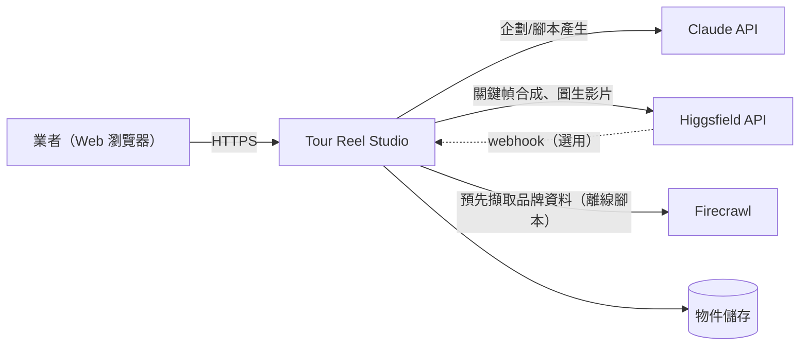
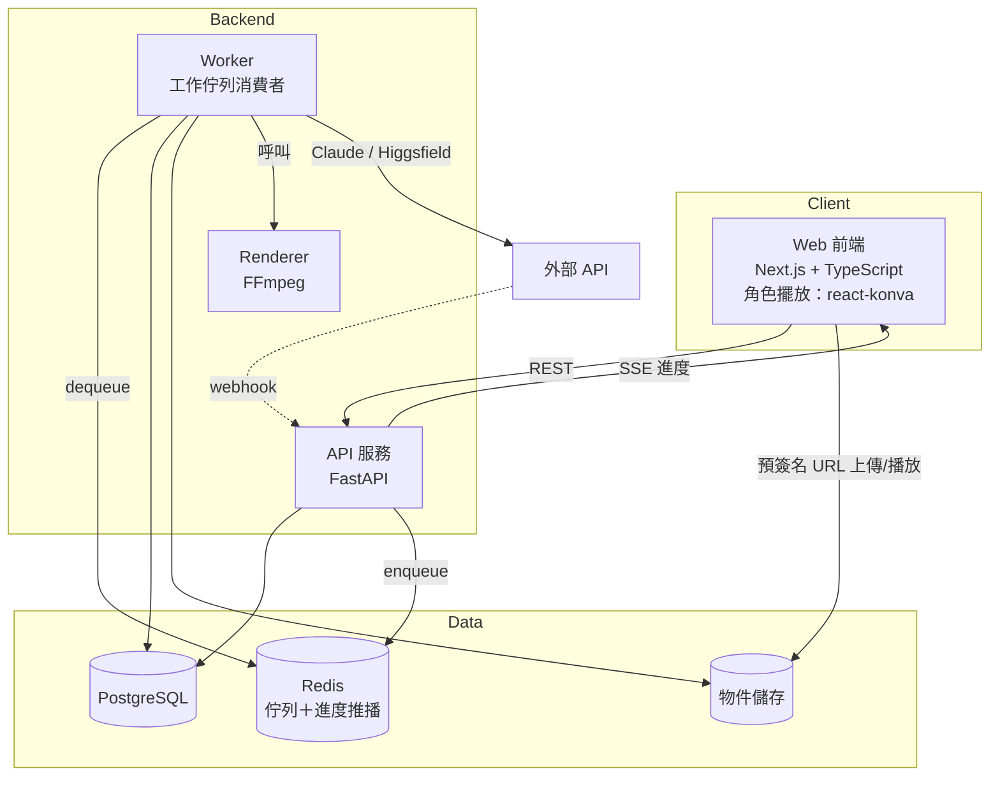
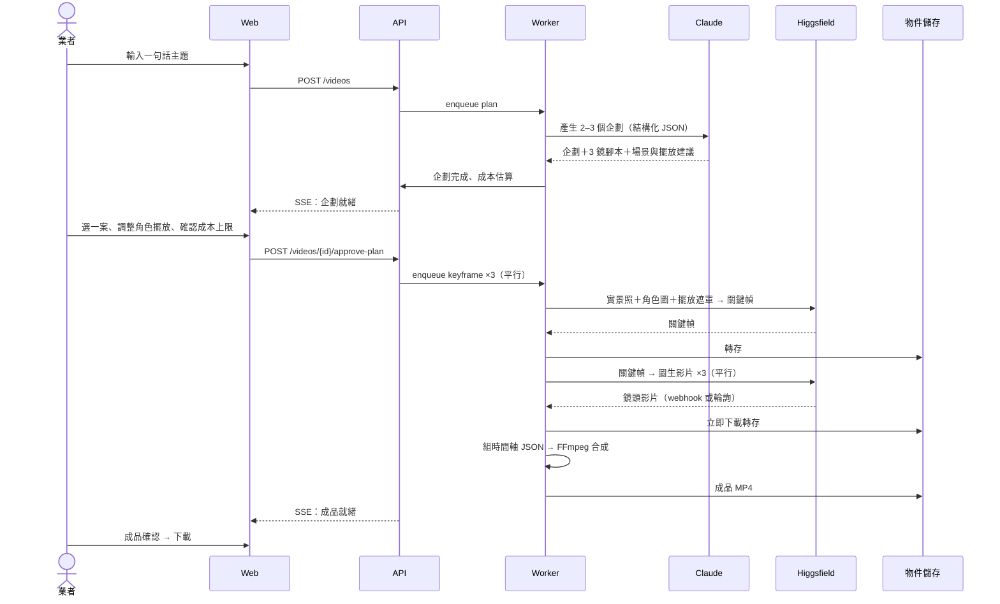
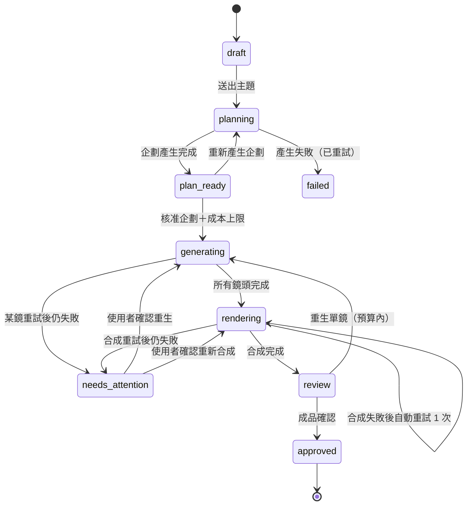
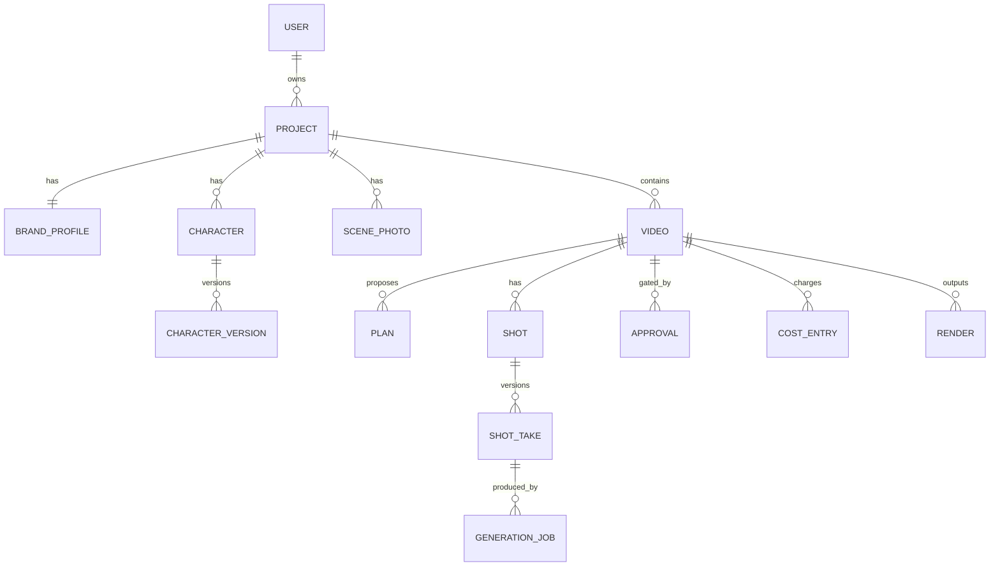

# Tour Reel Studio — 系統架構書

> 文件版本：v1.0（2026-09-29）
> 依據：`tourism-ai-video-concept.md` v0.3（以其第 8.1 節 MVP 範圍為準）
> 範圍：競賽 MVP 的完整架構，並標示第二、三階段的擴充接點

---

## 1. 文件目的與範圍

本文件定義 Tour Reel Studio MVP 的系統邊界、元件、資料模型、狀態機、API、部署方式與非功能需求，作為開發與競賽文件中「系統設計」章節的依據。

**MVP 一句話**：業者在 Web 介面選一個宣傳主題，確認企劃與成本，系統以 1 個已定妝角色與業者的實景照，自動產出一支 15 秒、3 鏡、9:16 的 IG Reels。

### 1.1 MVP 範圍摘要

| 項目 | MVP 做 | MVP 不做（留擴充接點） |
|---|---|---|
| 介面 | Web 前端 | 原生 App、AR |
| 流程 | 快速模式 | 進階模式（僅 wireframe） |
| 品牌資料 | 手動輸入＋預先擷取的官網內容 | Google Places、Meta、網路搜尋 |
| 資產 | 1 個已定妝角色、3–5 張實景照 | 候選定妝、造型變體、場景板 |
| 實景融合 | B1 照片合成 | A、B2、C、D |
| 創作引擎 | 受控 prompt＋結構化 JSON | drama-skills 完整整合（保留一條路徑） |
| 生成 | Higgsfield：1 個圖像模型＋1 個圖生影片模型 | 模型選擇、配音、多供應商 |
| 輸出 | 9:16、15 秒 MP4、繁中燒錄字幕、BGM、固定片尾 | 多比例、多語、編輯器 |

### 1.2 成功定義（取自構想文件）

- 從選題到輸出 **10 分鐘內** 完成
- 預備專案能**穩定**輸出一支可播放的 Reels
- 單鏡生成失敗可**自動重試一次**

---

## 2. 架構驅動因素

### 2.1 關鍵品質屬性

| 屬性 | 要求 | 架構對策 |
|---|---|---|
| 成本可控 | 生成前顯示預估點數；不得超出使用者核准的上限 | 成本估算器＋核准快照＋送出前預算檢查（§6.4） |
| 使用者核准 | 花錢的步驟必須經使用者確認；內容修改使核准失效 | 核准紀錄綁定輸入雜湊（§6.3） |
| 可靠性 | Demo 現場不能卡住 | 非同步工作佇列、冪等、單鏡重試、輪詢備援、保底成品（§9.3） |
| 速度 | 10 分鐘出片 | 3 鏡平行生成、預先準備資產 |
| 可替換性 | 模型、供應商、創作引擎可更換 | Provider 介面、CreativeEngine 介面（§5.4、§5.5） |
| 可擴充性 | 進階模式、AR、編輯器、商家洞察可後加 | 關卡設定化、時間軸 JSON、資料來源抽象（§11） |
| 可追溯 | 每個成品可還原其輸入與成本 | 生成工作保存輸入快照、外部 request ID、實際成本 |

### 2.2 限制

- 競賽時程短，團隊小：以**單一 repo、單一後端語言（Python）**降低維運負擔
- 外部服務為 Higgsfield（生成）與 Claude API（創作）；MVP 不依賴需審核的 API（Meta、Google Places）
- 生成結果在 Higgsfield 端保留有期限，完成後須立即轉存
- Demo 現場網路不可控：須能在無法接收 webhook 時以輪詢完成

---

## 3. 系統脈絡



| 外部系統 | 用途 | MVP 使用方式 |
|---|---|---|
| Claude API | 產生企劃、腳本、分鏡提示詞 | 即時呼叫，結構化 JSON 輸出 |
| Higgsfield API | 關鍵幀合成（圖像）、圖生影片 | 非同步；webhook＋輪詢 |
| Firecrawl | 官網 branding 與內容擷取 | **僅在建立 Demo 專案時由種子腳本執行一次**，結果存入品牌檔案 |
| 物件儲存 | 實景照、角色圖、關鍵幀、鏡頭影片、成品 | S3 相容（本機用 MinIO，雲端用 R2／S3） |

---

## 4. 容器架構



| 容器 | 技術 | 職責 |
|---|---|---|
| Web 前端 | Next.js、TypeScript、react-konva | 專案與品牌檔案確認、選題、企劃確認（含角色擺放）、進度、成品確認與下載 |
| API 服務 | Python、FastAPI、Pydantic | 驗證、資源 CRUD、狀態轉換、核准、成本估算、webhook 接收、SSE 進度 |
| Worker | Python、arq（Redis 佇列） | 執行所有耗時工作：企劃產生、關鍵幀、圖生影片、輪詢、下載轉存、合成 |
| Renderer | FFmpeg（Worker 內呼叫） | 依時間軸 JSON 輸出 MP4 |
| PostgreSQL | — | 所有結構化資料與狀態 |
| Redis | — | 工作佇列、進度事件 pub/sub |
| 物件儲存 | MinIO／R2／S3 | 所有二進位資產；前端以預簽名 URL 直接上傳與播放 |

**技術選擇理由**
- 後端統一 Python：Claude 與 Higgsfield 都有 Python SDK；FFmpeg、影像處理（去背、縮圖）生態完整
- 前端 Next.js：角色擺放需要可拖曳、縮放的畫布元件；React 生態成熟
- arq：輕量、原生 async，與 FastAPI 一致；MVP 不需要 Celery 的複雜度
- SSE 而非 WebSocket：進度只需伺服器單向推送，實作較簡單

---

## 5. 元件設計

### 5.1 後端模組

```
backend/
├─ api/            路由與請求驗證
├─ domain/         實體、狀態機、核准規則、成本規則（不依賴外部服務）
├─ creative/       CreativeEngine 介面與實作（PromptEngine、DramaSkillsEngine）
├─ providers/      ImageProvider / VideoProvider 介面與 Higgsfield 實作
├─ render/         時間軸 JSON 產生、FFmpeg 指令組裝、片尾卡產生
├─ jobs/           Worker 任務（plan、keyframe、video、poll、render）
├─ storage/        物件儲存封裝、預簽名 URL
└─ seed/           Demo 專案種子腳本（品牌擷取、角色與實景照匯入）
```

`domain/` 是核心：狀態轉換、核准失效、預算檢查都在這裡，並以單元測試覆蓋。其他模組只透過介面與它互動。

### 5.2 快速模式主流程



**兩個確認點**
1. **企劃確認**：選企劃、（可選）調整每鏡角色位置與大小、確認成本上限。此步驟同時是 B1 照片合成的擺放操作，避免多一個關卡。
2. **成品確認**：滿意即匯出；不滿意的鏡頭可重生（在剩餘預算內，否則再次詢問）。

### 5.3 B1 照片合成

**輸入**
- 實景照（業者上傳，已縮到生成模型接受的尺寸）
- 角色去背全身圖（PNG，透明背景）與身份板
- 擺放參數：`{x, y, scale, flip}`（以照片座標的比例值 0–1 表示，與解析度無關）

**處理**
1. Worker 依擺放參數把角色去背圖疊到實景照上，產生「粗合成圖」與「角色遮罩」
2. 送至 Higgsfield 圖像模型做精修合成：以粗合成圖為基底，身份板為參考，提示詞要求統一光線與陰影、保留背景不變
3. 產出關鍵幀，作為圖生影片首幀

**為什麼先做粗合成**：直接讓模型「把角色放到某處」位置不可控；先疊圖可讓位置與比例完全由使用者決定，模型只負責融合。這也是之後 AR（B2）的同一介面：AR 只是用更精確的方式產生相同的擺放參數與光線資訊（§11）。

### 5.4 創作引擎（CreativeEngine）

```python
class CreativeEngine(Protocol):
    async def propose_plans(self, ctx: PlanContext) -> list[PlanDraft]: ...
    async def build_shot_prompts(self, plan: Plan, ctx: PlanContext) -> list[ShotPrompt]: ...
```

| 實作 | 階段 | 說明 |
|---|---|---|
| `PromptEngine` | MVP 預設 | 以 `tourism-promo` 模板組 prompt，呼叫 Claude 取得符合 JSON Schema 的輸出；驗證失敗自動重試一次 |
| `DramaSkillsEngine` | MVP 保留一條路徑 / 第二階段主力 | 以 Claude Agent SDK 在影片工作目錄執行 drama-skills；解析 Markdown 產物轉為相同的 `PlanDraft`／`ShotPrompt` |

**`tourism-promo` 固定結構（MVP）**

| 鏡頭 | 功能 | 長度 | 內容 |
|---|---|---|---|
| s1 | 鉤子 | 約 4 秒 | 角色在最有辨識度的實景中開場 |
| s2 | 特色 | 約 5 秒 | 呈現選定的賣點 |
| s3 | 行動呼籲 | 約 3 秒 | 角色邀請，接固定片尾卡 |
| 片尾 | 模板 | 約 3 秒 | Logo、店名、地址、QR code |

**PlanContext** 包含：品牌檔案、主題句、角色身份錨點卡、可用實景照清單（含每張的文字描述）。

**PlanDraft 輸出 Schema（節錄）**

```json
{
  "title": "晨光裡的第一口梅子",
  "concept": "老闆角色帶遊客在清晨果園採梅",
  "tone": "溫馨家庭",
  "shots": [
    {
      "shot_no": 1,
      "role": "hook",
      "duration_s": 4,
      "scene_photo_id": "ph_02",
      "placement": { "x": 0.62, "y": 0.88, "scale": 0.45, "flip": false },
      "action": "角色轉身向鏡頭揮手",
      "subtitle": "早安！梅子熟了喔",
      "camera": "緩慢推進"
    }
  ],
  "cta": "私訊訂位｜台南市楠西區"
}
```

### 5.5 生成供應商（Provider）

```python
class ImageProvider(Protocol):
    async def compose(self, req: ComposeRequest) -> ProviderJob: ...

class VideoProvider(Protocol):
    async def image_to_video(self, req: I2VRequest) -> ProviderJob: ...

class ProviderJob(BaseModel):
    provider: str           # "higgsfield"
    model: str              # 由設定檔決定，不寫死在程式
    external_id: str
    estimated_cost: Credits

async def fetch_result(job: ProviderJob) -> ProviderResult: ...
```

- **Higgsfield 實作**：包裝其非同步 API（送出 → request ID → webhook／輪詢 → 結果 URL）
- **模型由設定檔指定**：`HF_IMAGE_MODEL`、`HF_VIDEO_MODEL`；MVP 各只允許一個已驗證的模型（見構想文件 §9 驗證 #3）
- **結果轉存**：取得結果 URL 後立即下載到自有物件儲存，資料庫只記錄自有路徑
- **不在 MVP 生成語音**：I2V 請求明確關閉音訊（若模型支援），音軌只有 BGM

### 5.6 合成（Renderer）

1. 依鏡頭結果組出時間軸 JSON（構想文件 §5.3 格式）
2. 片尾卡由模板產生：品牌主色背景、Logo、店名、地址、QR code（以 Pillow 產生 PNG，再轉成 3 秒影片段）
3. 字幕：產生 ASS 檔（Noto Sans TC、品牌主色描邊、置於安全區內）後燒錄
4. FFmpeg：統一各鏡為 1080×1920、30fps → 串接 → 燒錄字幕 → 混入 BGM（淡入淡出、音量 0.3）→ 輸出 H.264／AAC MP4
5. 產出縮圖，寫入成品紀錄

**時間軸 JSON 是唯一的合成依據**，即使 MVP 沒有編輯器，也一律先寫 JSON 再合成，確保之後的編輯器只需修改 JSON。

---

## 6. 狀態機與規則

### 6.1 影片（Video）狀態



### 6.2 生成工作（GenerationJob）狀態

```
queued → submitted → running → succeeded → stored
                          ↘ failed → （自動重試 1 次）→ submitted
                                   ↘ failed_final
```

| 規則 | 說明 |
|---|---|
| 自動重試 | 每個工作最多自動重試 1 次；重試不需要再次核准，但必須仍在預算上限內 |
| 逾時 | 超過設定時間（預設 10 分鐘）未完成視為失敗 |
| 冪等 | 以 `(video_id, shot_no, kind, input_hash, attempt)` 為唯一鍵，重複送出不會重複扣點 |
| 平行 | 同一支影片的 3 鏡平行執行；每鏡內「關鍵幀 → 影片」依序執行 |

**外部請求冪等**：建立 `GenerationJob` 時同時產生不可變的 `provider_idempotency_key`（例如 UUID）。同一次 `attempt` 無論 Worker 重啟、逾時重送或 webhook 重複送達，都必須帶相同 key 呼叫 Higgsfield；新的自動重試才建立新的 `attempt` 與新的 key。Provider 若不支援冪等鍵，Worker 必須先以既有 `external_id` 查詢結果，確認沒有已送出的請求才可重送。

### 6.3 核准與失效

- 每筆核准（Approval）記錄：核准類型、核准時的**輸入雜湊**、成本上限、核准者、時間
- 送出任何生成工作前，Worker 重新計算輸入雜湊；與核准時不同即拒絕送出，影片退回 `plan_ready` 等待重新確認
- 快速模式中系統自動採用的項目，以 `auto_approved = true` 記錄，供之後展開進階模式時辨識

### 6.4 成本控制

```
預估成本 = Σ(每鏡關鍵幀成本) + Σ(每鏡影片成本)
單鏡完整重生成本 = 該鏡關鍵幀成本 + 該鏡圖生影片成本
成本上限 = 預估成本 + max(單鏡完整重生成本)     # 預設預留最昂貴的一鏡完整重生
```

- 企劃確認頁分別顯示「本次生成預估」、「已預留的單鏡重生額度」與「最高成本上限」，使用者確認即核准此上限
- 每個工作送出前檢查：`已花費 + 此工作預估 ≤ 上限`，否則暫停並詢問
- 實際成本以 Higgsfield 回傳值寫入成本帳（CostLedger）；若無回傳則以單價表計算
- 單價表存於設定檔，隨模型更新

---

## 7. 資料模型



| 資料表 | 主要欄位 | 說明 |
|---|---|---|
| `users` | id, email, name | MVP 可用單一 Demo 帳號 |
| `projects` | id, user_id, name, output_defaults(json) | 一個店家一個專案 |
| `brand_profiles` | project_id, visual(json), selling_points(json), tone, info(json), sources(json), confirmed_at | `sources` 記錄每項資料來源（手動／官網擷取），為第二階段多來源預留 |
| `characters` | id, project_id, name, locked_version_id | MVP 每專案 1 個 |
| `character_versions` | id, character_id, version, identity_board_key, cutout_key, anchor_card(json), voice(json), status | `cutout_key` 為去背全身圖，供擺放使用 |
| `scene_photos` | id, project_id, image_key, description, width, height | MVP 3–5 張；第二階段擴充為場景板 |
| `videos` | id, project_id, mode, topic, status, selected_plan_id, cost_cap, timeline(json) | `mode`：quick／advanced |
| `plans` | id, video_id, payload(json), engine, created_at | 保存完整企劃 JSON 與使用的引擎 |
| `shots` | id, video_id, shot_no, role, duration_s, scene_photo_id, placement(json), prompt(json), current_take_id | |
| `shot_takes` | id, shot_id, attempt, keyframe_key, clip_key, status | 每次重生新增一筆，全部保留 |
| `generation_jobs` | id, shot_take_id, kind, provider, model, external_id, provider_idempotency_key, input_snapshot(json), input_hash, status, attempt, est_cost, actual_cost, error | 可追溯的核心；同一 attempt 重送外部請求時使用相同 `provider_idempotency_key` |
| `approvals` | id, video_id, kind, input_hash, cost_cap, auto_approved, approved_by, approved_at | |
| `cost_entries` | id, video_id, job_id, credits, created_at | 成本帳 |
| `renders` | id, video_id, aspect_ratio, subtitle_lang, mp4_key, thumb_key, created_at | 第二階段多比例、多語各一筆 |

**物件儲存路徑規則**
```
projects/{project_id}/brand/logo.png
projects/{project_id}/characters/{char_id}/v{n}/identity_board.png
projects/{project_id}/characters/{char_id}/v{n}/cutout.png
projects/{project_id}/scenes/{photo_id}.jpg
videos/{video_id}/shots/{shot_no}/take{n}/rough.png
videos/{video_id}/shots/{shot_no}/take{n}/keyframe.png
videos/{video_id}/shots/{shot_no}/take{n}/clip.mp4
videos/{video_id}/renders/{render_id}.mp4
```

---

## 8. API 設計

| 方法 | 路徑 | 說明 |
|---|---|---|
| `GET` | `/projects/{id}` | 專案、品牌檔案、角色、實景照 |
| `PATCH` | `/projects/{id}/brand-profile` | 修改並確認品牌檔案 |
| `POST` | `/projects/{id}/scene-photos` | 取得預簽名上傳 URL；上傳完成後回報 |
| `POST` | `/projects/{id}/videos` | 建立影片並送出主題，觸發企劃產生 |
| `GET` | `/videos/{id}` | 影片狀態、企劃、鏡頭、成本 |
| `GET` | `/videos/{id}/events` | SSE 進度串流 |
| `POST` | `/videos/{id}/plans/regenerate` | 重新產生企劃 |
| `POST` | `/videos/{id}/approve-plan` | body：`plan_id`、每鏡 `placement`、`cost_cap`；觸發生成 |
| `POST` | `/videos/{id}/shots/{no}/regenerate` | 成品確認時重生單鏡 |
| `POST` | `/videos/{id}/approve` | 成品確認 |
| `GET` | `/videos/{id}/download` | 成品預簽名下載 URL |
| `POST` | `/webhooks/higgsfield` | 接收生成結果（驗證簽章） |

**錯誤與一致性**
- 狀態不符的操作回 `409 Conflict`（例如在 `generating` 時修改企劃）
- `approve-plan` 帶 `Idempotency-Key` 標頭，避免使用者重複點擊造成重複扣點

---

## 9. 部署

### 9.1 MVP 部署拓撲

以 Docker Compose 部署於單台雲端主機（例如 2 vCPU／4 GB），另加託管物件儲存：

```
docker-compose
├─ web        Next.js（或部署到 Vercel）
├─ api        FastAPI（uvicorn）
├─ worker     arq worker × 1（併發 6：3 鏡 × 關鍵幀／影片）
├─ postgres
├─ redis
└─ caddy      HTTPS 反向代理（webhook 需要公開 HTTPS 網址）
物件儲存：Cloudflare R2 或 AWS S3（本機開發用 MinIO）
```

### 9.2 設定與機密

| 設定 | 說明 |
|---|---|
| `ANTHROPIC_API_KEY`、`HIGGSFIELD_API_KEY`、`FIRECRAWL_API_KEY` | 只存在後端環境變數；前端永遠不接觸 |
| `HF_IMAGE_MODEL`、`HF_VIDEO_MODEL` | 驗證後選定的模型 |
| `COST_TABLE` | 各模型單價表 |
| `RETRY_RESERVE_RATIO` | 成本上限的重試預留比例 |
| `WEBHOOK_ENABLED` | 關閉時只用輪詢（Demo 現場網路不穩時使用） |

### 9.3 Demo 可靠性措施

- **預備專案**：Demo 專案的品牌檔案、角色、實景照事先由種子腳本建立並確認
- **輪詢備援**：webhook 未到時，Worker 每 10 秒輪詢；關閉 webhook 也能完成
- **預熱**：Demo 前以同一專案跑過完整流程，確認模型與額度正常
- **保底成品**：保留一支事先完成的成品；現場生成超時時切換展示，並說明生成仍在背景進行
- **進度可見**：SSE 即時顯示每鏡狀態，等待期間畫面不空白

### 9.4 時間預算（目標值，待驗證 #3、#5 實測修正）

| 階段 | 目標 | 說明 |
|---|---|---|
| 企劃產生 | ≤ 40 秒 | Claude 結構化輸出 |
| 使用者確認企劃 | 約 2 分鐘 | 含調整擺放 |
| 關鍵幀 ×3（平行） | ≤ 1.5 分鐘 | |
| 圖生影片 ×3（平行） | ≤ 4 分鐘 | 最不確定的環節 |
| 合成 | ≤ 30 秒 | |
| **合計** | **約 8–9 分鐘** | 保留 1–2 分鐘給單鏡重試 |

---

## 10. 非功能需求

| 類別 | 需求 |
|---|---|
| 安全 | API 金鑰只在後端；物件一律私有、以短期預簽名 URL 存取；webhook 驗證簽章；上傳檔案限制類型與大小 |
| 隱私 | 品牌檔案不存評論者姓名或原文（第二階段接評論時生效）；業者照片僅用於該專案 |
| 可觀測性 | 結構化日誌帶 `video_id`、`job_id`；每個生成工作記錄耗時與成本；管理頁可查看失敗工作與錯誤訊息 |
| 效能 | 圖片上傳前於前端縮圖（長邊 ≤ 2048px）；鏡頭平行生成 |
| 可測試性 | `domain/` 單元測試（狀態轉換、核准失效、預算檢查）；Provider 提供 `FakeProvider`，可在無外部 API 下跑完整流程的整合測試 |
| 內容標示 | 每個鏡頭記錄 `source`（`ai_composite`、`template`…），成品可選擇在片尾加註 AI 生成標示 |

---

## 11. 擴充路徑

MVP 的每個介面都對應一個之後的擴充，不需重構：

| 擴充功能 | 接點 | 做法 |
|---|---|---|
| 進階模式 | 狀態機＋`approvals` | 將關卡設定化：每個階段有 `gate: auto / manual`，快速模式全部 auto（除企劃與成品），進階模式全部 manual；新增 `script_ready`、`assets_ready`、`keyframes_ready` 等等待狀態 |
| drama-skills 完整流程 | `CreativeEngine` | 切換為 `DramaSkillsEngine`；Markdown 工作目錄存於物件儲存，Agent 在 Worker 內執行 |
| AR 取景（B2） | `placement` 與 `ComposeRequest` | 原生 App 以 ARKit／ARCore 產生相同的擺放參數，另加 `camera_pose`、`light_estimate` 欄位；後端合成流程不變，只是提示詞多了光線資訊 |
| 實拍混剪（C） | 時間軸 JSON | 新增 `source: real_footage` 片段類型，業者上傳的影片直接進時間軸 |
| 場景板 | `scene_photos` | 擴充為 `scenes` 表，一個場景含多張照片、AR 機位紀錄、光線版本 |
| 候選定妝、造型變體 | `character_versions` | 已有版本機制；新增 `variant_of` 欄位 |
| 商家洞察 | `brand_profiles.sources` | 新增 `intel` 模組，每個來源（Places、Meta、搜尋）寫入獨立來源紀錄，彙整後產生待確認的品牌檔案 |
| 多比例、多語 | `renders` | 每個輸出組合一筆 render；字幕重翻譯只重跑合成；配音需重生鏡頭並走成本核准 |
| 時間軸編輯器 | `videos.timeline` | 編輯器直接修改 JSON，再呼叫合成；片段可連回 `shot_take` 觸發 AI 重生 |
| 其他供應商 | `ImageProvider`／`VideoProvider` | 新增實作並在設定檔切換 |

---

## 12. Repo 結構

MVP 採**單一 repo（monorepo）**，降低多 repo 同步成本；構想文件 §10 的五個 repo 對應為目錄，之後需要時再拆分。

```
tour-reel-studio/
├─ docx/                     構想文件、本架構書
├─ apps/
│  └─ web/                   Next.js 前端          （對應 tour-reel-studio-app）
├─ backend/                  FastAPI＋Worker       （對應 -api、-render）
│  ├─ api/ domain/ jobs/ providers/ render/ storage/
│  └─ creative/                                   （對應 -agent）
│     ├─ prompt_engine/
│     ├─ drama_skills_engine/
│     └─ skills/tourism-promo/SKILL.md
├─ intel/                    第二階段商家洞察       （對應 -intel）
├─ seed/                     Demo 專案種子資料與腳本
├─ infra/                    docker-compose、Caddyfile、.env.example
└─ tests/
```

---

## 13. 開發里程碑（建議）

| 里程碑 | 內容 | 完成標準 |
|---|---|---|
| M0 技術驗證 | 構想文件驗證 #1–#4：模板、B1 合成、模型組合、角色一致性 | 選定 `HF_IMAGE_MODEL`、`HF_VIDEO_MODEL` 與單價表 |
| M1 骨架 | 資料模型、狀態機、FakeProvider、SSE 進度 | 以 FakeProvider 跑完整快速模式流程 |
| M2 生成串接 | PromptEngine、Higgsfield adapter、轉存、成本控制 | 真實生成 3 鏡並存入物件儲存 |
| M3 合成與介面 | Renderer、片尾卡、企劃確認與擺放介面、成品確認 | 輸出可播放的 15 秒 MP4 |
| M4 Demo 強化 | 種子腳本、輪詢備援、保底成品、驗證 #5 計時測試 | 3 位非技術使用者 10 分鐘內完成 |

---

## 14. 待決事項

### 14.1 需要決定

| # | 問題 | 建議 |
|---|---|---|
| 1 | 角色去背圖如何產生 | MVP 在種子階段準備好；第二階段加入自動去背（例如 rembg） |
| 2 | BGM 來源 | 準備 3–5 首授權曲，依企劃調性自動選一首 |
| 3 | 使用者帳號 | MVP 用單一 Demo 帳號；正式版再接登入 |
| 4 | Higgsfield webhook 簽章機制 | 依其文件實作；若無簽章，改用隨機 token 路徑並以輪詢結果為準 |

### 14.2 構想文件中發現的不一致

以下幾處與 v0.3 的 MVP 範圍（§8.1）不一致，建議一併修正：

| 位置 | 目前內容 | 建議 |
|---|---|---|
| §3.1 建立專案 ③ | 「上傳實景照或用 AR 取景」 | MVP 只有上傳實景照；AR 標為第二階段 |
| §3.3 快速模式 | 「專案內若還沒有任何實景照，快速模式會先引導業者拍 3 張照片或做一次 AR 取景」 | MVP 預備專案已有實景照，可註明此引導為第二階段 |
| §4.3 模式總覽 | B2 標為「主力」但階段為第二階段 | 改為 MVP 主力是 B1，B2 為第二階段主力 |
| §5 系統架構圖 | 前端含 AR 取景模組、商家洞察含 Google／Meta | 標註哪些是 MVP、哪些是擴充，或改參照本架構書 |
| §10 Repo 規劃 | 五個獨立 repo，app 含 AR | 依本架構書 §12 改為 monorepo |
| §7 風險表 | AR 相關風險在 MVP 不會發生 | 可保留，但標註適用階段 |
